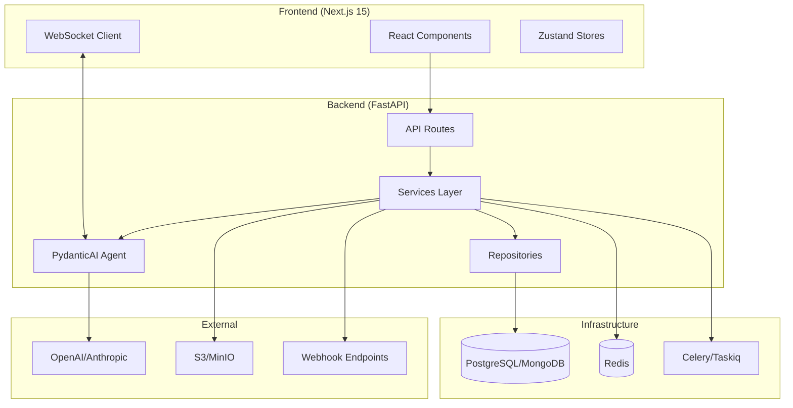
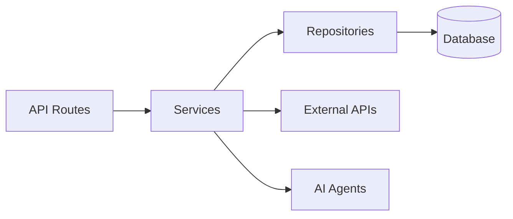

# Full-Stack FastAPI + Next.js Template for AI/LLM Applications

<p align="center">
  <a href="https://github.com/ak-labs/full-stack-fastapi-nextjs-llm-template/stargazers"></a>
  <a href="https://github.com/ak-labs/full-stack-fastapi-nextjs-llm-template/blob/main/LICENSE"></a>
  <a href="https://www.python.org/"></a>
  <a href="https://pypi.org/project/fastapi-gen/"></a>
  
</p>

<p align="center">
  <b>Production-ready project generator for AI/LLM applications with 20+ enterprise integrations.</b><br>
  <sub>Built with FastAPI, Next.js 15, PydanticAI, and everything you need for professional business applications.</sub>
</p>

<p align="center">
  <a href="#-why-this-template">Why This Template</a> •
  <a href="#-features">Features</a> •
  <a href="#-quick-start">Quick Start</a> •
  <a href="#-architecture">Architecture</a> •
  <a href="#-ai-agent">AI Agent</a> •
  <a href="#-documentation">Documentation</a>
</p>

---

## Star History

<a href="https://www.star-history.com/#ak-labs/full-stack-fastapi-nextjs-llm-template&type=Date&legend=top-left">
 <picture>
   <source media="(prefers-color-scheme: dark)" srcset="https://api.star-history.com/svg?repos=ak-labs/full-stack-fastapi-nextjs-llm-template&type=Date&theme=dark" />
   <source media="(prefers-color-scheme: light)" srcset="https://api.star-history.com/svg?repos=ak-labs/full-stack-fastapi-nextjs-llm-template&type=Date" />
   
 </picture>
</a>

---

## 🎯 Why This Template

Building AI/LLM applications requires more than just an API wrapper. You need:

- **Type-safe AI agents** with tool/function calling
- **Real-time streaming** responses via WebSocket
- **Conversation persistence** and history management
- **Production infrastructure** - auth, rate limiting, observability
- **Enterprise integrations** - background tasks, webhooks, admin panels

This template gives you all of that out of the box, with **20+ configurable integrations** so you can focus on building your AI product, not boilerplate.

### Perfect For

- 🤖 **AI Chatbots & Assistants** - PydanticAI agents with streaming responses
- 📊 **ML Applications** - Background task processing with Celery/Taskiq
- 🏢 **Enterprise SaaS** - Full auth, admin panel, webhooks, and more
- 🚀 **Startups** - Ship fast with production-ready infrastructure

---

## ✨ Features

### 🤖 AI/LLM First

- **[PydanticAI](https://ai.pydantic.dev)** - Type-safe AI agents with tool support
- **WebSocket Streaming** - Real-time responses using `iter()` method
- **Conversation Persistence** - Save chat history to database
- **Custom Tools** - Easily extend agent capabilities
- **Multi-model Support** - OpenAI, Anthropic, and more

### ⚡ Backend (FastAPI)

- **[FastAPI](https://fastapi.tiangolo.com)** + **[Pydantic v2](https://docs.pydantic.dev)** - High-performance async API
- **Multiple Databases** - PostgreSQL (async), MongoDB (async), SQLite
- **Authentication** - JWT + Refresh tokens, API Keys, OAuth2 (Google)
- **Background Tasks** - Celery, Taskiq, or ARQ
- **Django-style CLI** - Custom management commands with auto-discovery

### 🎨 Frontend (Next.js 15)

- **React 19** + **TypeScript** + **Tailwind CSS v4**
- **AI Chat Interface** - WebSocket streaming, tool call visualization
- **Authentication** - HTTP-only cookies, auto-refresh
- **Dark Mode** + **i18n** (optional)

### 🔌 20+ Enterprise Integrations

| Category | Integrations |
|----------|-------------|
| **Caching & State** | Redis, fastapi-cache2 |
| **Security** | Rate limiting, CORS, CSRF protection |
| **Observability** | Logfire, Sentry, Prometheus |
| **Admin** | SQLAdmin panel with auth |
| **Storage** | S3/MinIO file uploads |
| **Events** | Webhooks, WebSockets |
| **DevOps** | Docker, GitHub Actions, GitLab CI, Kubernetes |

---

## 🏗️ Architecture



### Layered Architecture

The backend follows a clean **Repository + Service** pattern:



| Layer | Responsibility |
|-------|---------------|
| **Routes** | HTTP handling, validation, auth |
| **Services** | Business logic, orchestration |
| **Repositories** | Data access, queries |

See [Architecture Documentation](./docs/architecture.md) for details.

---

## 🚀 Quick Start

### Installation

```bash
# pip
pip install fastapi-gen

# uv (recommended)
uv tool install fastapi-gen

# pipx
pipx install fastapi-gen
```

### Create Your Project

```bash
# Interactive wizard (recommended)
fastapi-gen new

# Quick mode with options
fastapi-gen create my_ai_app \
  --database postgresql \
  --auth jwt \
  --frontend nextjs
```

### Start Development

```bash
cd my_ai_app

# Backend
cd backend
uv sync
cp .env.example .env
alembic upgrade head
uv run uvicorn app.main:app --reload

# Frontend (new terminal)
cd frontend
bun install
bun dev
```

**Access:**
- API: http://localhost:8000
- Docs: http://localhost:8000/docs
- Frontend: http://localhost:3000

---

## 🤖 AI Agent

### PydanticAI Integration

The template includes a fully configured AI agent with:

```python
# app/agents/assistant.py
from pydantic_ai import Agent, RunContext

@dataclass
class Deps:
    user_id: str | None = None
    db: AsyncSession | None = None

agent = Agent[Deps, str](
    model="openai:gpt-4o-mini",
    system_prompt="You are a helpful assistant.",
)

@agent.tool
async def search_database(ctx: RunContext[Deps], query: str) -> list[dict]:
    """Search the database for relevant information."""
    # Access user context and database via ctx.deps
    ...
```

### WebSocket Streaming

Real-time responses with full event access:

```python
@router.websocket("/ws")
async def agent_ws(websocket: WebSocket):
    await websocket.accept()

    async for event in agent.iter(user_input, deps=deps):
        if isinstance(event, PartDeltaEvent):
            await websocket.send_json({
                "type": "token",
                "content": event.delta.content
            })
```

### Adding Custom Tools

```python
@agent.tool
async def get_weather(ctx: RunContext[Deps], city: str) -> dict:
    """Get current weather for a city."""
    async with httpx.AsyncClient() as client:
        response = await client.get(f"https://api.weather.com/{city}")
        return response.json()
```

See [AI Agent Documentation](./docs/ai-agent.md) for more.

---

## 🛠️ Django-style CLI

Each generated project includes a powerful CLI inspired by Django's management commands:

### Built-in Commands

```bash
# Server
my_app server run --reload
my_app server routes

# Database (Alembic wrapper)
my_app db init
my_app db migrate -m "Add users"
my_app db upgrade

# Users
my_app user create --email admin@example.com --superuser
my_app user list
```

### Custom Commands

Create your own commands with auto-discovery:

```python
# app/commands/seed.py
from app.commands import command, success, error
import click

@command("seed", help="Seed database with test data")
@click.option("--count", "-c", default=10, type=int)
@click.option("--dry-run", is_flag=True)
def seed_database(count: int, dry_run: bool):
    """Seed the database with sample data."""
    if dry_run:
        info(f"[DRY RUN] Would create {count} records")
        return

    # Your logic here
    success(f"Created {count} records!")
```

Commands are **automatically discovered** from `app/commands/` - just create a file and use the `@command` decorator.

```bash
my_app cmd seed --count 100
my_app cmd seed --dry-run
```

---

## 📁 Generated Project Structure

```
my_project/
├── backend/
│   ├── app/
│   │   ├── main.py              # FastAPI app with lifespan
│   │   ├── api/
│   │   │   ├── routes/v1/       # Versioned API endpoints
│   │   │   ├── deps.py          # Dependency injection
│   │   │   └── router.py        # Route aggregation
│   │   ├── core/                # Config, security, middleware
│   │   ├── db/models/           # SQLAlchemy/MongoDB models
│   │   ├── schemas/             # Pydantic schemas
│   │   ├── repositories/        # Data access layer
│   │   ├── services/            # Business logic
│   │   ├── agents/              # PydanticAI agents
│   │   ├── commands/            # Django-style CLI commands
│   │   └── worker/              # Background tasks
│   ├── cli/                     # Project CLI
│   ├── tests/                   # pytest test suite
│   └── alembic/                 # Database migrations
├── frontend/
│   ├── src/
│   │   ├── app/                 # Next.js App Router
│   │   ├── components/          # React components
│   │   ├── hooks/               # useChat, useWebSocket, etc.
│   │   └── stores/              # Zustand state management
│   └── e2e/                     # Playwright tests
├── docker-compose.yml
├── Makefile
└── README.md
```

---

## ⚙️ Configuration Options

### Core Options

| Option | Values | Description |
|--------|--------|-------------|
| **Database** | `postgresql`, `mongodb`, `sqlite`, `none` | Async by default |
| **Auth** | `jwt`, `api_key`, `both`, `none` | JWT includes user management |
| **OAuth** | `none`, `google` | Social login |
| **Background Tasks** | `none`, `celery`, `taskiq`, `arq` | Distributed queues |
| **Frontend** | `none`, `nextjs` | Next.js 15 + React 19 |

### Integrations

Select what you need:

```bash
fastapi-gen new
# ✓ Redis (caching/sessions)
# ✓ Rate limiting (slowapi)
# ✓ Pagination (fastapi-pagination)
# ✓ Admin Panel (SQLAdmin)
# ✓ AI Agent (PydanticAI)
# ✓ Webhooks
# ✓ File Storage (S3/MinIO)
# ✓ Sentry
# ✓ Logfire
# ✓ Prometheus
# ... and more
```

---

## 📚 Documentation

| Document | Description |
|----------|-------------|
| [Architecture](./docs/architecture.md) | Repository + Service pattern, layered design |
| [Frontend](./docs/frontend.md) | Next.js setup, auth, state management |
| [AI Agent](./docs/ai-agent.md) | PydanticAI, tools, WebSocket streaming |
| [Deployment](./docs/deployment.md) | Docker, Kubernetes, production setup |
| [Development](./docs/development.md) | Local setup, testing, debugging |

---

## 🙏 Inspiration

This project is inspired by:

- [full-stack-fastapi-template](https://github.com/fastapi/full-stack-fastapi-template) by @tiangolo
- [fastapi-template](https://github.com/s3rius/fastapi-template) by @s3rius
- [FastAPI Best Practices](https://github.com/zhanymkanov/fastapi-best-practices) by @zhanymkanov
- Django's management commands system

---

## 🤝 Contributing

Contributions are welcome! Please read our [Contributing Guide](./CONTRIBUTING.md) for details.

---

## 📄 License

MIT License - see [LICENSE](./LICENSE) for details.

---

<p align="center">
  Made with ❤️ by <a href="https://github.com/ak-labs">AK Labs</a>
</p>
